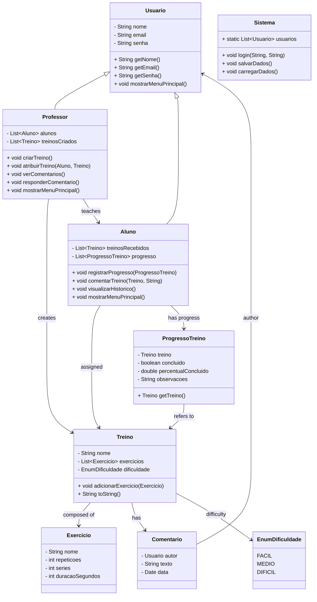

# MC322-POO-Projeto_Final
Este repositório é composto do projeto final realizado na matéria de Programação Orientada à Objeto do Instituto de Computação da Faculdade Estadual de Campinas no primeiro semestre de 2025

# Sistema de Treinos Físicos

Este projeto é um sistema de gerenciamento de treinos físicos com funcionalidades para alunos e professores. Professores podem criar e atribuir treinos, acompanhar o progresso e responder aos comentários dos alunos. Alunos podem registrar progresso, comentar sobre os treinos e visualizar seu histórico de atividades.

## Diagrama de Classes (UML)

