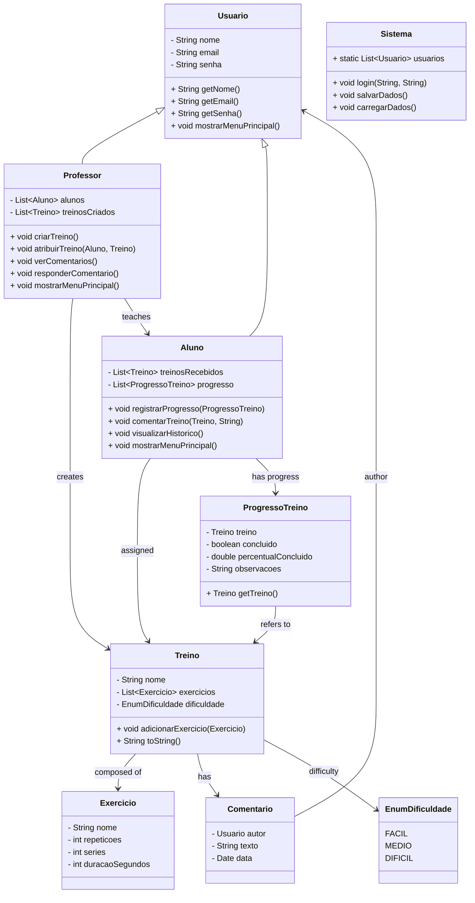

# MC322-POO-Projeto_Final
Este repositório é composto do projeto final realizado na matéria de Programação Orientada à Objeto do Instituto de Computação da Faculdade Estadual de Campinas no primeiro semestre de 2025

## 🏋️‍♂️ Sistema de Treinos Físicos

### Descrição Geral do Sistema

Este projeto é um sistema de gerenciamento de treinos físicos com funcionalidades específicas para **alunos** e **professores**.  

---

## 👥 Funcionalidades por Tipo de Usuário

### 🧑‍🎓 Aluno
- Fazer login/cadastro no sistema.
- Visualizar os treinos recebidos (que são enviados pelos professores desse aluno).
- Registrar o progresso nos treinos.
- Visualizar histórico dos treinos realizados.
- Comentar sobre os treinos.
- Adicionar professores (o aluno é responsavel por se inscrever como aluno de um deerminado professor).

### 🧑‍🏫 Professor
- Fazer login/cadastro no sistema.
- Criar novos treinos (treinos são compostos de exercícios).
- Visualizar treinos criados.
- Indicar treinos para um aluno.
- Visualizar seus alunos.
- Visualizar/Responder recados dos alunos.

---

## 🧱 Estrutura de Classes
### 🔹 `Sistema`
- Gerencia o **cadastro** e **login** de usuários (professores e alunos).
- Utiliza **serialização** para salvar e recuperar os dados dos usuários no arquivo `Arquivo.dat`.
- Responsável por carregar os dados ao iniciar o sistema. Contém o método salvarDados, utilizado por outras classes sempre que é necessário guardar novas informações.

### 🔹 `Usuario`
- Classe base para `Aluno` e `Professor`.
- Contém atributos comuns como `nome`, `userName` e `senha`, que são comuns a alunos e professores.

### 🔹 `Aluno` *(herda de Usuario)*
- Classe específica para representar usuários do tipo aluno.
- Armazena os professores vinculados (o Aluno é responsável por se vincular ao professor, isso é feito no botão adicionar Professor), treinos recebidos e o progresso do aluno.

### 🔹 `Professor` *(herda de Usuario)*
- Classe específica para representar usuários do tipo professor.
- Armazena os alunos sob sua responsabilidade, os treinos criados e os recados trocados com os alunos.

### 🔹 `Treino`
- Representa um conjunto de exercícios com as seguintes propriedades:
  - `nome` (título do treino)
  - `dificuldade` (enum: fácil, médio, difícil)
  - Lista de exercícios (`ArrayList<Exercicio>`)

### 🔹 `Exercicio`
- Classe base para os exercícios físicos.
- Atributos:
  - `nome`
  - `numSeries`
  - `intervalo` (tempo de descanso entre as séries)

### 🔹 `ExercicioDuracao` *(herda de Exercicio)*
- Define exercícios baseados em **tempo** (em segundos/minutos).

### 🔹 `ExercicioRepeticao` *(herda de Exercicio)*
- Define exercícios baseados em **repetições**.

### 🔹 `Classes do package Tela`
- São usadas para controlar a navegação entre painéis da interface.
- Permitem que, em uma mesma janela, diferentes painéis (telas) sejam exibidos conforme o fluxo seguido pelo usuário.

---

## 🛠️ Tecnologias Utilizadas
- **Java** - Versão utilizada: 21.0.5
- **Swing (interface gráfica)**

--- 

### Execução:
Para executar o programa siga os seguintes passos:
- Entre na pasta do projeto
  Exemplo:
  ``` bash
  cd MC322-POO-Projeto_Final
  
- Para compilar o programa utilize o comando no terminal (linux):
  ``` bash
  javac Main.java

- Para rodar o programa utilize o comando no terminal (linux):
  ``` bash
  java Main.java

--- 

## Diagrama de Classes (UML)



