# MC322-POO-Projeto_Final
Este repositório é composto do projeto final realizado na matéria de Programação Orientada à Objeto do Instituto de Computação da Faculdade Estadual de Campinas no primeiro semestre de 2025

## 🏋️‍♂️ Sistema de Treinos Físicos

### Descrição Geral do Sistema

Este projeto é um sistema de gerenciamento de treinos físicos com funcionalidades específicas para **alunos** e **professores**.  

---

## 👥 Funcionalidades por Tipo de Usuário

### 🧑‍🎓 Aluno
- Fazer login/cadastro no sistema.
- Visualizar os treinos recebidos (que são enviados pelos professores desse aluno).
- Registrar o progresso nos treinos.
- Visualizar histórico dos treinos realizados.
- Comentar sobre os treinos.
- Adicionar professores (o aluno é responsavel por se inscrever como aluno de um deerminado professor).

### 🧑‍🏫 Professor
- Fazer login/cadastro no sistema.
- Criar novos treinos (treinos são compostos de exercícios).
- Visualizar treinos criados.
- Indicar treinos para um aluno.
- Visualizar seus alunos.
- Visualizar/Responder recados dos alunos.

---

## 🧱 Estrutura de Classes
### 🔹 `Sistema`
- Gerencia o **cadastro** e **login** de usuários (professores e alunos).
- Utiliza **serialização** para salvar e recuperar os dados dos usuários no arquivo `Arquivo.dat`.
- Responsável por carregar os dados ao iniciar o sistema. Contém o método salvarDados, utilizado por outras classes sempre que é necessário guardar novas informações.

### 🔹 `Usuario`
- Classe base para `Aluno` e `Professor`.
- Contém atributos comuns como `nome`, `userName` e `senha`, que são comuns a alunos e professores.

### 🔹 `Aluno` *(herda de Usuario)*
- Classe específica para representar usuários do tipo aluno.
- Armazena os professores vinculados (o Aluno é responsável por se vincular ao professor, isso é feito no botão adicionar Professor), treinos recebidos e o progresso do aluno.

### 🔹 `Professor` *(herda de Usuario)*
- Classe específica para representar usuários do tipo professor.
- Armazena os alunos sob sua responsabilidade, os treinos criados e os recados trocados com os alunos.

### 🔹 `Treino`
- Representa um conjunto de exercícios com as seguintes propriedades:
  - `nome` (título do treino)
  - `dificuldade` (enum: fácil, médio, difícil)
  - Lista de exercícios (`ArrayList<Exercicio>`)

### 🔹 `Exercicio`
- Classe base para os exercícios físicos.
- Atributos:
  - `nome`
  - `numSeries`
  - `intervalo` (tempo de descanso entre as séries)

### 🔹 `ExercicioDuracao` *(herda de Exercicio)*
- Define exercícios baseados em **tempo** (em segundos/minutos).

### 🔹 `ExercicioRepeticao` *(herda de Exercicio)*
- Define exercícios baseados em **repetições**.

### 🔹 `Classes Telas`
- São usadas para controlar a navegação entre painéis da interface.
- Permitem que, em uma mesma janela, diferentes painéis (telas) sejam exibidos conforme o fluxo seguido pelo usuário.

---

## 🛠️ Tecnologias Utilizadas
- **Java** - Versão utilizada: 21.0.5
- **Swing (interface gráfica)**

--- 

### Execução:
Para executar o programa siga os seguintes passos:
- Entre na pasta do projeto
  Exemplo:
  ``` bash
  cd MC322-POO-Projeto_Final
  
- Para compilar o programa utilize o comando no terminal (linux):
  ``` bash
  javac Main.java

- Para rodar o programa utilize o comando no terminal (linux):
  ``` bash
  java Main.java

--- 

## Desenvolvedoras
- Ana Luiza Mota Gomes - 242389
- Anita Ramos Almeida - 173273
- Daniela Souza Cardoso Naves - 281141
- Priscilla Almeida - 176205

---
## Diagrama de Classes (UML)

```mermaid
---
config:
  class:
    hideEmptyMembersBox: true
---
classDiagram
direction LR
    class CadastroInvalidoException {
	    
    }
    class Usuario {
	    - nome : String
	    - userName : String
	    - senha : String
	    - mensagens : ArrayList
	    + getNome() : String
	    + getUserName() : String
	    + getSenha() : String
	    + adicionarMensagem(comentario) : void
	    + getMensagens() : ArrayList
    }
    class Sistema {
        - ARQUIVOS_USUARIOS : String
        - professores : ArrayList<Professor>
        - alunos : ArrayList<Aluno>
        - usuarios : ArrayList<Usuario>
	    + cadastro(nome, userName, senha, caso) : void
	    + login(userName, senha) : Usuario
	    + salvarDados() : void
	    + carregarDados() : void
	    + getArrayProfessores() : ArrayList
	    + getArrayAlunos() : ArrayList
    }
    class Comentario {
        - autor : Usuario
        - texto : String
        - data : Date
	    + getAutor() : Usuario
	    + getTexto() : String
	    + getData() : Date
	    + toString() : String
    }
    class Exercicio {
	    - nome : String
	    - numSeries : int
	    - intervalo : Tempo
	    + getNome() : String
	    + getNumSeries() : int
	    + getIntervalo() : Tempo
    }
    class ExercicioDuracao {
	    - duracao : Tempo
	    + getDuracao() : Tempo
	    + descreverExercicio() : String
    }
    class Professor {
	    - alunos : ArrayList
	    - treinosCriados : ArrayList
	    - novosRecados : int
	    - readObject(in) : void
	    + criarTreino() : void
	    + adicionarExercicio() : void
	    + addAluno(aluno) : void
	    + adicionarTreino(treino) : void
	    + getAlunos() : ArrayList
	    + getNovosRecados() : int
	    + incrementarNovosRecados() : void
	    + zerarNovosRecados() : void
	    + getTreinosCriados() : ArrayList
	    + atribuirTreino(aluno, treino) : void
	    + verComentarios() : void
	    + responderComentario() : void
	    + mostrarMenuPrincipal(entrada) : void
    }
    class Aluno {
	    - professores : ArrayList
	    - treinosRecebidos : ArrayList
	    - progresso : ArrayList
	    - novosRecados : int
	    - readObject(in) : void
	    + registrarProgresso(progresso) : void
	    + comentarTreino(treino, comentario) : void
	    + visualizarHistorico() : void
	    + getNovosRecados() : int
	    + incrementarNovosRecados() : void
	    + zerarNovosRecados() : void
	    + addProf(prof) : void
	    + getProfessores() : ArrayList
	    + getTreinosRecebidos() : ArrayList
	    + getProgresso() : ArrayList
	    + mostrarMenuPrincipal(entrada) : void
    }

    class ExercicioRepeticoes {
	    - repeticoes : int
	    + getRepeticoes() : int
	    + descreverExercicio() : String
    }

    class TreinoExecutavel {
	    - treino : Treino
	    - profResponsavel : Professor
	    - percentualConcluido : double
	    - concluido : boolean
	    - observacoes : ArrayList
	    - readObject(in) : void
	    + getTreino() : Treino
	    + getProfResponsavel() : Professor
	    + getPercentual() : double
	    + setPercentual(percentual) : void
	    + setConcluido() : void
    }
    
    class Treino {
	    - nome : String
	    - dificuldade : EnumDificuldade
	    - exercicios : ArrayList
	    - readObject(in) : void
	    + getNome() : String
	    + getDificuldade() : EnumDificuldade
	    + getArrayExercicios() : ArrayList
	    + adicionarExercicio(exercicio) : void
	    + toString() : String
    }

    class Tempo {
	    - duracao : int
	    - medida : EnumTempo
	    + getTempo() : int
	    + getMedida() : EnumTempo
    }

    class Main {
	     
    }

    class TelaLogin {
	    - campoUserName : JTextField
	    - campoSenha : JPasswordField
	    + limparCampos() : void
    }

    class TelaAdicionarProf {
	     
    }
    
    class TelaNovoTreino {
	     
    }

    class TelaIndicarParaAluno {

    }

    class TelaProfessor {
	     
    }
    
    class TelaEscolherTipo {
	     
    }
    class TelaCriadorTreino {
	     
    }
    class TelaCriadorExRepeticoes {
	     
    }
    class TelaCriadorExDuracao {
	    + criarCampo(dimensao) : JTextField
	    + criarCaixaSelecao(dimensao) : JComboBox
    }
    
    class TelaCadastro {
	    - campoNome : JTextField
	    - campoUserName : JTextField
	    - campoSenha : JPasswordField
	    + limparCampos() : void
    }

    class TelaAluno {
	     
    }

    class TelaVisualizarTreinos {
	     
    }

    class TelaVisualizarHistorico {
	     
    }

    class TelaRegistrarProgresso {
	     
    }

    class TelaTreinosCriados {
	     
    }

    class TelaRecados {
	     
    }

    class TelaVisualizarAlunos {
	     
    }


    ExercicioDuracao --> Tempo
    Professor --> Aluno
    Professor --> Treino
    Aluno --> Professor
    Aluno --> Treino
    Aluno --> TreinoExecutavel
    Treino --> Exercicio
    TreinoExecutavel --> Treino
    TreinoExecutavel --> Professor
    ExercicioRepeticoes --> Exercicio
    ExercicioDuracao --> Exercicio
    Aluno <|-- Usuario
    Professor <|-- Usuario

```



